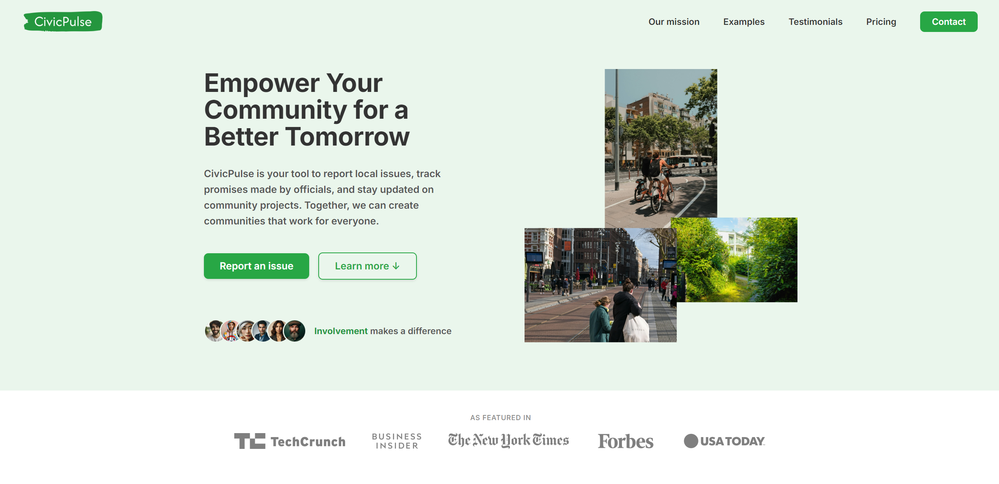
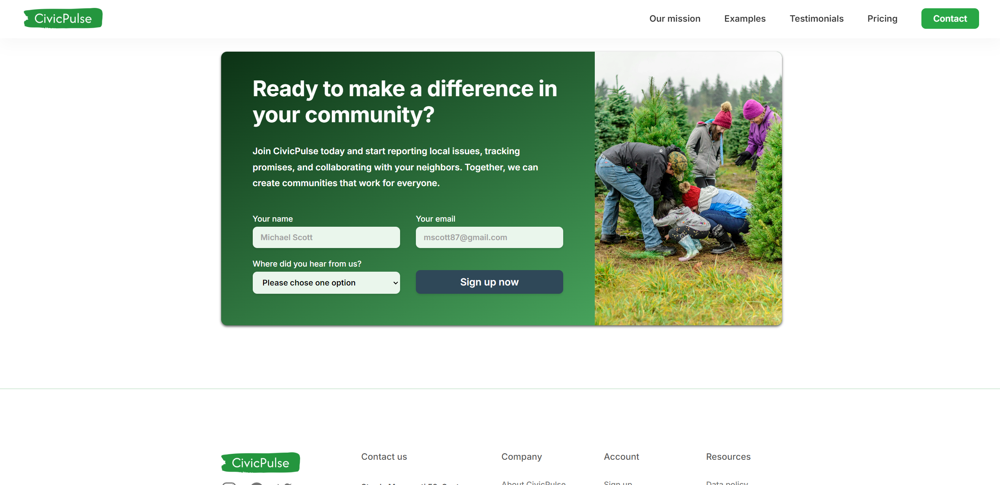
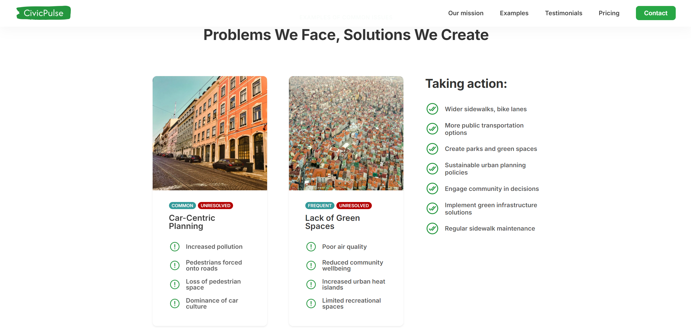
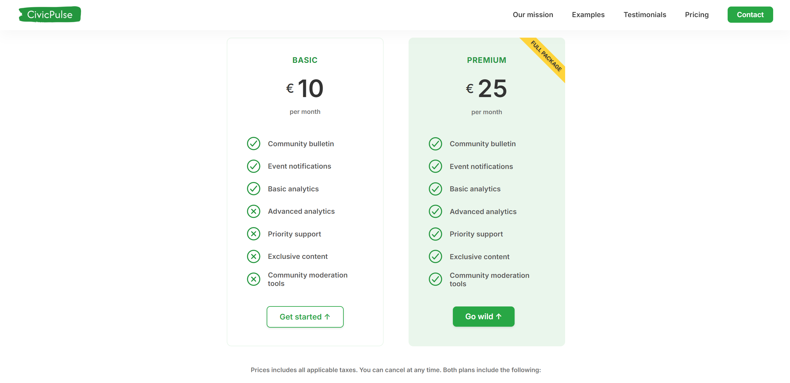
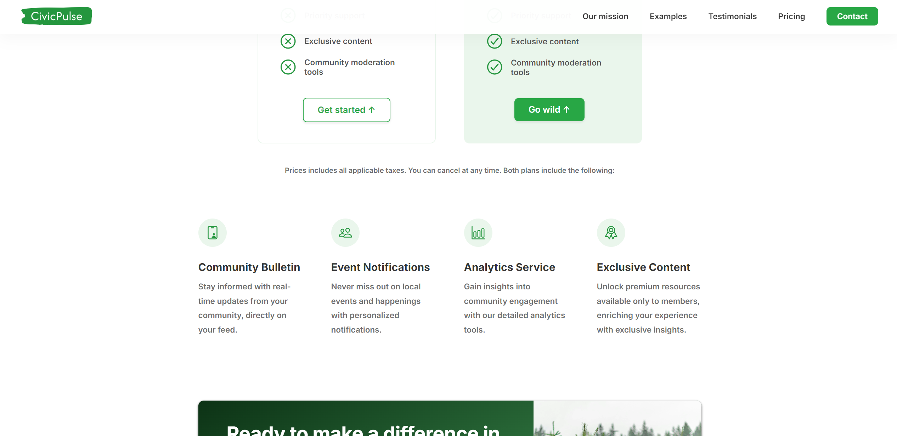

# CivicPulse

## About CivicPulse

### Description

We are a civic technology company focused on empowering citizens to improve their communities. Our website allows users to track problems in their town and hold officials accountable. Users can report issues like potholes or broken streetlights, track promises made by officials during their campaigns, and monitor ongoing projects. CivicPulse keeps you informed and ensures that your voice is heard, helping to create towns that are designed for people, not just cars and businesses.

### Branding

**Headline:** Empowering citizens, improving communities

**Brand color:** #28A745

### Summary

CivicPulse is your tool for community empowerment. Track issues, hold officials accountable, and ensure your town is built for the people.

## CivicPulse features

### Report Issues

Quickly report local problems like potholes, broken lights, or unsafe sidewalks directly through the website.

### Track Promises

Monitor the promises made by local officials during their campaigns and see which ones have been fulfilled.

### Project Updates

Stay updated on the progress of local projects, and see if officials are delivering on their commitments.

### Community Involvement

Engage with other citizens, share updates, and work together to improve your community.

### Make Your Town Better in 3 Simple Steps

1. **Report a Problem:** See something wrong in your town? Report it in seconds using CivicPulse. Whether it's a pothole or an overflowing trash can, your report gets sent to the relevant authorities.

2. **Track and Monitor:** Keep track of your reports and see real-time updates on the status of issues. Monitor projects and promises to see how officials are performing.

3. **Engage and Collaborate:** Join forces with other community members. Share reports, collaborate on solutions, and create a stronger voice together.

### CivicPulse Supports Various Community Needs

- **Green Spaces:** Parks, gardens, and recreational areas.
- **Infrastructure:** Roads, sidewalks, and public facilities.
- **Safety:** Streetlights, crosswalks, and traffic signals.
- **Schools:** Education facilities and playgrounds.
- **Accessibility:** Pavement space, ramps, and public transport.

### We Offer Free Registration

Join CivicPulse for free and start making a difference in your community. Together, we can create better towns for everyone. Sign up today and start reporting!

### Subscription Plans

Prices include all applicable taxes. Users can cancel at any time.

Basic: Free

- Report issues
- Track local problems
- Access community forums

Pro: custom amount per month (the user decides the amount)

- Priority issue tracking
- Detailed project updates
- Advanced reporting tools
- Exclusive community features

## Photo Gallery

## Contact Information

- Strada Marasesti 52, Sector 4, 040254, Bucharest, Romania
- +40 723 654 198
- hicivicpulse@gmail.com

Social Profiles:

- Instagram
- Facebook
- Twitter

[Links for the socials are not available at the given moment]
